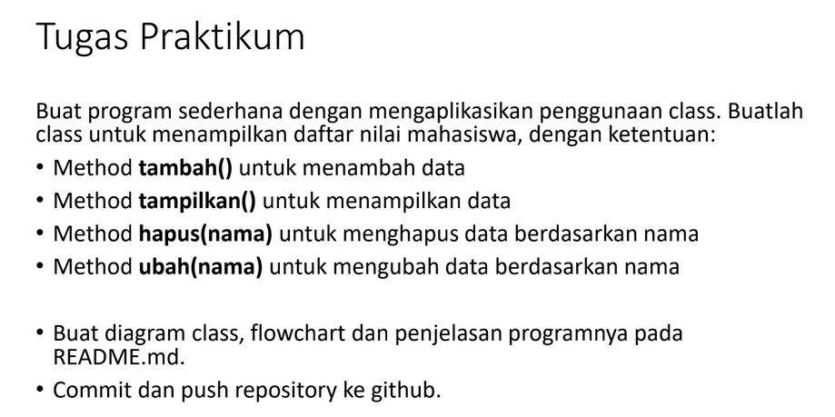
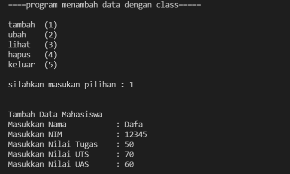
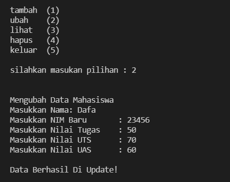
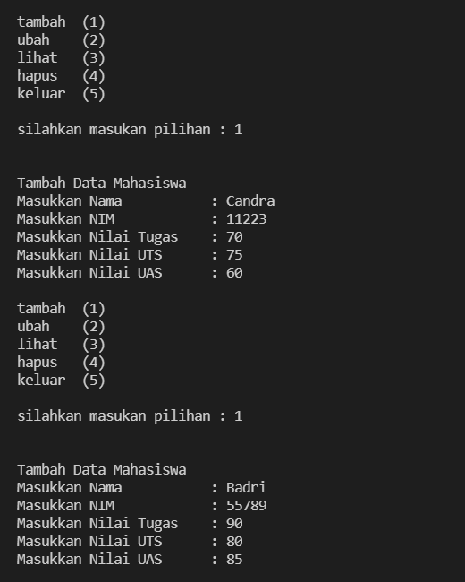
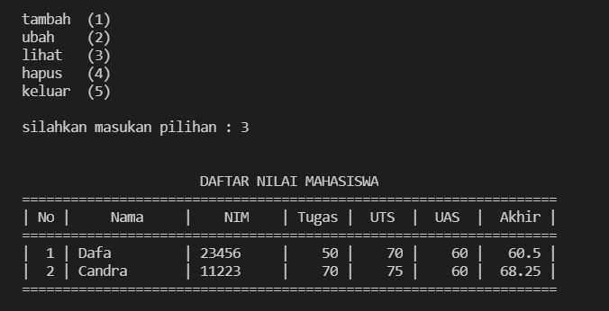
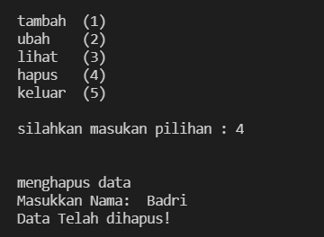
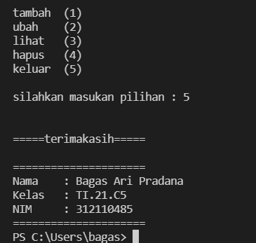

# Pertemuan12

pada pertemuan 12 saya diberi soal :



## Diagram Class


## Flowchart

Untuk Flowchart bisa di akses [Flowchart](Flowchart.pdf)

## PROGRAM

pertama saya membuat sebuah class daftar nilai

````py
    class daftarNilai()
````

Lalu saya melanjutkan dengan membuat method method fungsinya

````py
    def tambah(self)
    def ubah(self)
    def lihat(self)
    def hapus(self)
````

lalu saya mengisi setiap method dengan elemen elemen nya

````py
    nama= input("masukan nama: ")
    nim= input("masukan nim :")                                         
    nilaiTugas= int(input("Masukkan Nilai Tugas: "))
    nilaiUts= int(input("Masukkan Nilai UTS\t: "))            
    nilaiUas= int(input("Masukkan Nilai UAS\t: "))             
    nilaiAkhir= (0.30 * nilaiTugas) + (0.35 * nilaiUts) + (0.35 * nilaiUas)
    dt[nama]=nim,nilaiTugas,nilaiUts,nilaiUas,nilaiAkhir
````

lalu saya membuat sebuah looping

````py
    while True:
        input('tambah   (1)
            ubah     (2)
            lihat    (3)
            hapus    (4)
            ')
            c = input("\nsilahkan masukan pilihan : ")
````

dan terakhir membuat fungsi if else untuk menjalankan method

````py
    if (c=="1"):
        data.tambah()
    elif (c=="2"):
        data.ubah()
    elif (c=="3"):
        data.lihat()
    elif (c=="4"):
        data.hapus()
    else:
        data.keluar()
        break
````

## Code Program
Untuk Code program bisa di akses [Program](Class.py)

## Output

ini adalah output apabila memilih tambah(1)



ini adalah output apabila memilih ubah(2)



ini adalah output apabila memilih untuk tambah lagi



ini adalah output apabila memilih hapus(3)



ini adalah output apabila memilih lihat (4)



ini adalah output apabila memilih else/keluar(5)



======TERIMAKASIH======